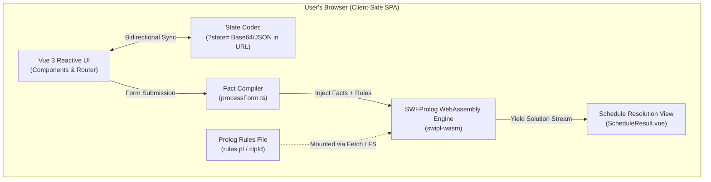

# Declarative Class Scheduler

## In-Browser Timetable Optimization powered by SWI-Prolog & WebAssembly

[](https://github.com/psvansluis/class-scheduler/actions/workflows/deploy.yml)
[](https://vuejs.org/)
[](https://vitejs.dev/)
[](https://www.typescriptlang.org/)
[](https://www.swi-prolog.org/)

[**Visit the scheduler**](https://psvansluis.github.io/class-scheduler/)

---

## Overview & Motivation

Generating school or university timetables is a classical **Constraint Satisfaction Problem (CSP)** and combinatorial optimization challenge. Traditional scheduling systems usually rely on heavy server-side backends, relational databases, and complex custom heuristics.

**Declarative Class Scheduler** is an experimental proof-of-concept proving that modern web standards can turn this paradigm on its head:

- **Logic Programming in the Browser**: Leverages **SWI-Prolog compiled to WebAssembly (`swipl-wasm`)** to execute formal logic deductions and constraint satisfaction natively inside the client's browser.
- **Zero-Backend Architecture**: 100% static hosting on GitHub Pages. No backend server, no database, no ongoing cloud infrastructure costs, and zero data telemetry.
- **Shareable, URL-Persisted State**: Your entire schedule setup—skills, teachers, and courses—is serialized directly into the URL query parameters. No user accounts or login required: bookmark, reload, or send the link to a colleague to instantly share the exact state.
- **Design & Craft**: Built not only to explore declarative computing, but to experiment with modern frontend craft, bespoke aesthetic themes, and accessible reactive UI.

---

## Architecture

The application runs entirely client-side as a single-page application (SPA). When the user updates parameters and requests a schedule, the application compiles reactive form state into Prolog facts, mounts an in-memory virtual filesystem, and queries the WebAssembly Prolog engine.



### Key Technical Pillars

- **Vue 3 + TypeScript**: Built with the Composition API (`<script setup>`) and strict type definitions for robust domain safety.
- **SWI-Prolog WASM**: Loads the full Prolog runtime into WebAssembly, running logical queries asynchronously without blocking the UI thread.
- **State in URL**: Pure client-side persistence using `formCodec.ts` and `stateQuery.ts`. The state survives page refreshes and enables frictionless sharing via a single URL.
- **Deterministic Asset Delivery**: A custom Vite dev/build plugin serves `prolog/rules.pl` during local development and bundles it deterministically into production releases.

---

## Quick Start

### Prerequisites

- **Node.js**: `v20.x` or later
- **npm**: `v10.x` or later

### Installation & Local Development

1. **Clone the repository:**

   ```bash
   git clone https://github.com/psvansluis/class-scheduler.git
   cd class-scheduler
   ```

2. **Install dependencies:**

   ```bash
   npm install
   ```

3. **Start the local development server:**

   ```bash
   npm run dev
   ```

   Open your browser at `http://localhost:5173/class-scheduler/`.

---

## Testing Strategy

The project features a dual-layer automated testing setup covering both low-level logic rules and end-to-end browser workflows:

```bash
# Run both Prolog logic tests and Playwright E2E tests
npm test
```

### 1. Prolog Engine Unit Tests (`PlUnit`)

Runs Prolog specifications directly in Node.js via `swipl-wasm` without needing a native Prolog installation:

```bash
npm run test:prolog
```

Tests reside in [`prolog/tests.pl`](prolog/tests.pl) and are orchestrated by [`prolog/runner.ts`](prolog/runner.ts).

### 2. Playwright End-to-End Tests

Verifies DOM interactions, hash-based URL hydration, and query resolution in a real browser environment:

```bash
npm run test:playwright
```

Spec files are located in [`e2e/`](e2e/):

- [`e2e/routing.spec.ts`](e2e/routing.spec.ts): Verifies hash-history navigation.
- [`e2e/prolog.spec.ts`](e2e/prolog.spec.ts): Fills out the form and validates end-to-end solver execution.

---

## 🛠 Available Scripts

| Command                   | Purpose                                                                      |
| :------------------------ | :--------------------------------------------------------------------------- |
| `npm run dev`             | Starts the Vite development server with Prolog rule middleware               |
| `npm run build`           | Validates TypeScript with `vue-tsc` and bundles static assets for production |
| `npm run preview`         | Previews the production build locally                                        |
| `npm run test:prolog`     | Executes Prolog unit tests via `swipl-wasm` in Node.js                       |
| `npm run test:playwright` | Runs headless Playwright E2E browser tests                                   |
| `npm test`                | Runs the full test suite (Prolog unit tests + Playwright E2E)                |
| `npm run issue`           | CLI utility to generate numbered issue markdown templates in `.issues/`      |

---

## Deployment Pipeline

Continuous Integration and Deployment are managed via [GitHub Actions](.github/workflows/deploy.yml):

1. **Trigger**: Every push to the `main` branch or manual `workflow_dispatch`.
2. **Quality Gates**:
   - Clean install via `npm ci`
   - Static type and template validation via `vue-tsc --noEmit`
   - Prolog logic unit test suite execution
   - Full Playwright E2E suite execution
3. **Build & Release**:
   - Production bundle compiled to `dist/` with `/class-scheduler/` base path.
   - Deployed directly to **GitHub Pages** with zero downtime.

---

## 🗺 Roadmap

The project is evolving from bipartite teacher-course matching to a full timetabling constraint solver:

- [x] **In-Browser SWI-Prolog Engine**: Client-side execution via WebAssembly.
- [x] **URL State Codec**: Serverless bookmarkable and shareable configuration.
- [ ] **CLP(FD) Timeslot Grid (Issue #007 & #010)**:
  - 5-day $\times$ 8-period discrete timetable grid.
  - Teacher availability allow-lists.
  - Hard constraint modeling: no double-booking, back-to-back sessions, minimum day gaps between sessions.
- [ ] **Room & Resource Allocation (Issue #008)**:
  - Rooms with capacity and specialized facilities (e.g., science labs, gyms).
  - Room collision avoidance.
- [ ] **Student Cohorts (Issue #009)**:
  - Cohort-based curricula and conflict-free student schedules.
- [ ] **Aesthetic Themes (Issue #003)**:
  - Distinct visual personalities: _Corporate SLDS_, _Codex Argenteus Gothic_, _Sacred Scheduler_, and _Seventies Retro_.
- [ ] **Compact URL Minification (Issue #002)**:
  - LZ-based string compression for compact state sharing.

---

## 📄 License

This project is open source and available under the [MIT License](LICENSE).
